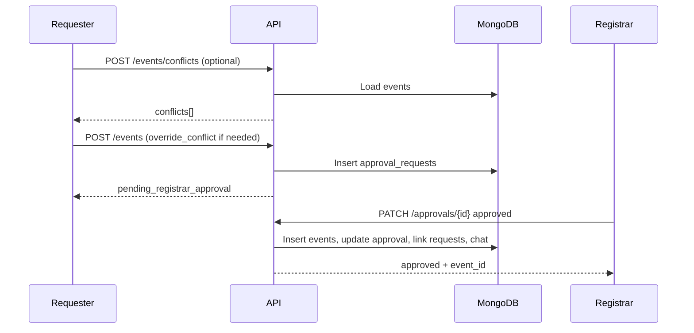
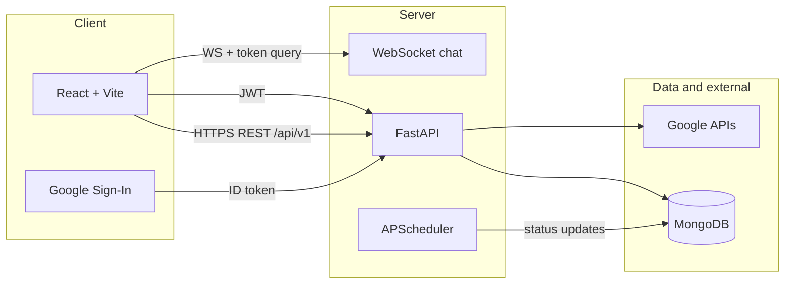

# Event Booking Management

A full-stack web application for institutional event planning: Google sign-in, venue scheduling with conflict handling, multi-team approval and support workflows (approvals, facility, marketing, IT), Google Calendar integration, Gmail invites, Drive-backed reports and publications, in-app chat, NAAC/IQAC evidence uploads, and an admin console for oversight.

**Repository layout**

| Path | Purpose |
|------|---------|
| `Client/` | React 18 + Vite 7 SPA |
| `Server/` | FastAPI API, MongoDB (Beanie/Motor), background jobs |
| `docs/` | Supplementary docs (e.g. IQAC access matrix) |

---

## Table of contents

1. [Features (summary)](#features-summary)
2. [Feature reference](#feature-reference)
3. [Workflow reference](#workflow-reference)
4. [Architecture](#architecture)
5. [Tech stack](#tech-stack)
6. [Roles and access](#roles-and-access)
7. [Project structure](#project-structure)
8. [Data model (MongoDB)](#data-model-mongodb)
9. [API overview](#api-overview)
10. [Environment variables](#environment-variables)
11. [Google Cloud setup](#google-cloud-setup)
12. [Run locally](#run-locally)
13. [Production and deployment notes](#production-and-deployment-notes)
14. [Security and operations](#security-and-operations)
15. [Troubleshooting](#troubleshooting)

---

## Features (summary)

- **Authentication**: Google sign-in, domain allowlist, JWT; admins and pre-assigned roles.
- **Events**: Registrar-gated creation, conflicts, lifecycle statuses, reports, closure.
- **Approvals, facility, marketing, IT**: Request and inbox workflows; marketing deliverables on Drive.
- **Venues, calendar, invites, publications**: Shared resources and Google APIs.
- **Chat**: REST + WebSocket; direct and event group threads.
- **IQAC**: NAAC-style evidence files by criterion (restricted roles).
- **Admin console**: Cross-cutting lists, deletes, overview.

The sections **[Feature reference](#feature-reference)** and **[Workflow reference](#workflow-reference)** below explain each area and the end-to-end processes in detail.

---

## Feature reference

### Authentication and sessions

**What it does:** Users prove identity with Google’s ID token. The backend calls Google’s tokeninfo endpoint, checks the email against `ALLOWED_EMAIL_DOMAINS`, then issues a JWT used on every API call (`Authorization: Bearer`).

**Details:**

- New users are upserted into `users` with a default role (typically faculty). Emails listed in `ADMIN_EMAILS` get the **admin** role on first login.
- **Pending roles**: Admins can register emails in `pending_role_assignments` (via **Admin → add user**). When that person first signs in, they receive registrar, facility_manager, marketing, or it (see `Server/routers/users.py`).
- **JWT lifetime** is controlled by `ACCESS_TOKEN_EXPIRE_MINUTES`. The client stores the token (e.g. localStorage) and the shared API client dispatches `auth:unauthorized` on `401`.
- **Google OAuth (extended scopes)** is separate from login: users open the Calendar connect flow so the app can store `google_refresh_token` / access token on the user for Calendar, Gmail, and Drive.

**Primary APIs:** `POST /auth/google`, `GET /auth/google/status`, role email helpers under `/auth/…`.

---

### Venues

**What it does:** Maintains a canonical list of venue names used when scheduling events.

**Details:** Venues are simple documents with a unique `name`. Seeding (`POST /venues/seed`) helps bootstrap data; admins can add or remove venues. Event conflict checks compare **same venue + overlapping time range**.

**Primary APIs:** `GET/POST /venues`, `POST /venues/seed`, `DELETE /venues/{venue_id}`.

---

### Event submission, conflicts, and lifecycle

**What it does:** Faculty (or other requesters) propose events. The system enforces venue/time rules, ties proposals to registrar approval, and tracks each live event through **upcoming → ongoing → completed → closed**.

**Important behavior (backend):**

- **`POST /events` does not create a live `Event` immediately.** It always creates an **`approval_requests`** row for the **registrar** (`requested_to` is the primary registrar email from the user with role `registrar`). The response status is along the lines of `pending_registrar_approval`.
- **Conflict check:** `POST /events/conflicts` returns overlapping events for the same `venue_name`. On create, if `override_conflict` is false and there is overlap, the API returns **409** with a `conflicts` payload. If `override_conflict` is true, creation proceeds and the flag is stored on the approval for re-check at registrar approval time.
- **Report backlog guard:** If the same user has **five or more** `completed` events **without** a report (`report_file_id`), new event submission is blocked until they upload reports for some of them.
- **Live events** exist only after registrar **approval** (see Approvals). Status is derived from current time vs start/end (`event_status.py`), and **`update_event_statuses`** runs on a **5-minute** schedule plus on relevant reads (e.g. report upload).

**Primary APIs:** `GET /events`, `POST /events/conflicts`, `POST /events`, `GET /events/{id}/details`, `POST /events/{id}/report`, `PATCH /events/{id}/status`.

---

### Registrar approvals

**What it does:** The registrar (or whoever owns the inbox email matching `requested_to`) **approves** or **rejects** proposals. Approval creates the real **`Event`** and triggers downstream automation.

**Details:**

- **Inbox:** `GET /approvals/inbox` returns requests where `requested_to` matches the current user’s email (case-insensitive).
- **My submissions:** `GET /approvals/me` lists the current user’s approval requests (paginated).
- **Decision:** `PATCH /approvals/{id}` with `approved` or `rejected`. If the event **start is already in the past**, decisions are blocked.
- **On approve:** A new `Event` is inserted (with conflict check unless the approval had `override_conflict`). Optional **Google Calendar** sync runs for the requester’s connected account. **Facility / marketing / IT** requests that were filed with the same requester, title, and schedule but **no `event_id` yet** get linked to the new event. An **event group chat** may be created, and the requester can receive a **Gmail** notification from the registrar’s token (if available).

**Primary APIs:** `GET /approvals/me`, `GET /approvals/inbox`, `PATCH /approvals/{request_id}`.

---

### Facility manager requests

**What it does:** After an event exists, organizers can ask the facility team for **venue setup** and **refreshments**, with free-text notes.

**Details:** Requests store `event_id` when tied to an approved event (or can match pre-approval rows that get linked on approval). Facility users see an **inbox**; they approve/reject (or equivalent status) via PATCH. Requesters can list their own with `GET /facility/requests/me`.

**Primary APIs:** `POST /facility/requests`, `GET /facility/inbox`, `GET /facility/requests/me`, `PATCH /facility/requests/{request_id}`.

---

### Marketing requests and deliverables

**What it does:** Organizers request creative work—posters, video, LinkedIn, photography, etc.—with dimensions and notes. Marketing staff fulfill requests and attach **files in Google Drive** (or mark items N/A).

**Details:** Marketing inbox lists pending work. Decisions use `PATCH /marketing/requests/{id}`. **Deliverables** are appended as structured records (type, Drive file id, links, `is_na`). Upload endpoints support **single** and **batch** deliverable submission (rate limited).

**Primary APIs:** `POST /marketing/requests`, `GET /marketing/inbox`, `GET /marketing/requests/me`, `PATCH /marketing/requests/{request_id}`, `POST …/deliverable`, `POST …/deliverables/batch`.

---

### IT requests

**What it does:** Organizers request AV/IT support: **online vs offline**, **PA system**, **projection**, plus notes.

**Details:** Same pattern as facility/marketing: create request, IT inbox, PATCH to decide, `GET /it/requests/me` for the requester.

**Primary APIs:** `POST /it/requests`, `GET /it/inbox`, `GET /it/requests/me`, `PATCH /it/requests/{request_id}`.

---

### Google Calendar, app calendar, and OAuth

**What it does:** Connects a user’s Google account for **Calendar API**, **Gmail**, and **Drive** (combined scope in `auth.py`). The UI can show **all approved app events** or the user’s **personal Google Calendar** events.

**Details:**

- **Connect:** `GET /api/v1/calendar/connect-url` returns an OAuth URL; callback is **`GET /calendar/oauth/callback`** (no `/api/v1` prefix) or **`GET /api/v1/calendar/oauth/callback`**. `GOOGLE_REDIRECT_URI` and Google Cloud **Authorized redirect URIs** must match **the deployed API host** exactly (not the static frontend URL if the API is separate).
- **`GET /calendar/app-events`:** Reads **`Event`** documents from MongoDB and returns FullCalendar-friendly items (optional start/end window). This is the **institutional schedule** after approvals.
- **`GET /calendar/events`:** Calls **Google Calendar API** with the user’s token (personal calendar view).
- Approved events may get a **Google Calendar event** created for the requester when the registrar approves (best effort; failures are logged and the DB event still exists).

---

### Invites (Gmail)

**What it does:** Sends invitation emails for an event using **Gmail API** (`users/me/messages/send`), using the **sender’s** stored OAuth token.

**Details:** The backend builds a MIME message, base64-encodes it, and posts to Gmail. Records in `invites` track recipient, subject, body, and sent metadata. **`GET /invites/me`** lists the current user’s sent invites.

**Primary APIs:** `POST /invites`, `GET /invites/me`.

---

### Event reports (PDF) and closing

**What it does:** After an event is **completed**, the organizer uploads a **PDF** report. The file is stored in **Google Drive** (`GOOGLE_DRIVE_FOLDER_ID`). After upload, the organizer can set status to **closed**.

**Rules enforced by the API:**

- Only the **event owner** (`created_by`) may upload or close.
- Report upload only when status is **completed**; only **`application/pdf`**; max **10 MB**.
- Filename must match exactly: **`{SanitizedEventName}_{StartDate}_Report.pdf`** (see server `get_expected_report_filename`).
- **Close** (`PATCH` with `closed`) requires status **completed** and an existing **`report_file_id`**.

The **client** typically builds the PDF (e.g. jsPDF) from structured fields (executive summary, attendance, agenda, outcomes, etc.).

---

### Publications

**What it does:** Users record **research and media outputs** (journal article, book, video, webpage, etc.) with rich metadata and optionally a file in **`PUBLICATIONS_DRIVE_FOLDER_ID`**.

**Details:** `POST /publications` accepts multipart data; listing is paginated. Useful for institutional reporting separate from one-off events.

**Primary APIs:** `POST /publications`, `GET /publications`.

---

### Chat (REST + WebSocket)

**What it does:** In-app messaging between users, plus **event-scoped group threads** (registrar, creator, participants). Supports **attachments**, **read receipts**, and **real-time** updates over WebSocket.

**Details:**

- REST is used for listing users, conversations, messages, posting messages, marking read, and uploading chat files.
- **WebSocket:** `WS /api/v1/chat/ws?token=<JWT>` — the server maps connections by user id and broadcasts JSON events (new messages, typing, reads, etc.).
- Chat uploads are rate limited.

**Primary APIs:** `GET /chat/users`, `GET /chat/conversations/me`, `POST /chat/conversations`, `GET/POST` messages paths, `POST /chat/read`, `POST /chat/upload`, `WS /chat/ws`.

---

### IQAC data collection

**What it does:** Stores accreditation evidence files against **NAAC-style criteria** (criterion 1–7, subfolders such as `1.1`, items such as `1.1.1`).

**Details:** Files are tracked in **`iqac_files`** and stored under the configured uploads root. Only **IQAC**, **Admin**, and **Registrar** roles may use these APIs; others receive **403**. See **[docs/IQAC_ACCESS.md](docs/IQAC_ACCESS.md)** and keep backend `IQAC_ALLOWED_ROLES` in sync with frontend `ROLES_WITH_IQAC_ACCESS`.

**Primary APIs:** `GET /iqac/criteria`, `GET /iqac/counts`, folder file list/upload, `DELETE /iqac/files/{id}`, download.

---

### Admin console and user management

**What it does:** **Admin** and **Registrar** users get an **Admin** section in the UI and access to **`/admin/*`** and **`/users/*`**.

**Details:**

- **Users:** List all users, add pending role by email, change role, delete user (with safeguards).
- **Admin overview:** Aggregated counts and paginated tables for events, reports, approvals, facility/marketing/IT, invites, publications, venues, with **delete** endpoints for cleanup operations.

**Primary APIs:** `Server/routers/admin.py`, `Server/routers/users.py`.

---

### Client application shell

**What it does:** A single React app (`App.jsx`) drives the dashboard: sidebar navigation, modals for forms, **FullCalendar** for calendar views, and **React Router** routes such as `/`, `/events`, `/event-reports`, `/calendar`, `/approvals`, `/requirements`, `/publications`, `/iqac-data`, `/admin`.

**Details:** API calls go through `Client/src/services/api.js` with base URL `VITE_API_BASE_URL` + `/api/v1`.

---

## Workflow reference

End-to-end processes as implemented today. Steps mention **UI** (what users do) and **API/system** (what happens on the server).

### Workflow 1: First-time access and sign-in

1. User opens the client and clicks **Sign in with Google**.
2. Google returns an **ID token** to the client.
3. Client calls **`POST /auth/google`** with that token.
4. Server validates token and domain, creates or updates **`users`**, applies **admin** or **pending_role_assignment** role rules, returns **JWT**.
5. Client stores the JWT and loads the main app. Subsequent requests send `Authorization: Bearer <jwt>`.

---

### Workflow 2: Connect Google (Calendar / Gmail / Drive)

1. Authenticated user starts “Connect Google” (or similar) in the UI.
2. Client calls **`GET /api/v1/calendar/connect-url`** and opens the returned URL.
3. User consents in Google; browser hits the **callback URL** from `GOOGLE_REDIRECT_URI` (typically **`https://<api-host>/calendar/oauth/callback`**) with `code` and `state`.
4. Server exchanges the code, saves **refresh/access tokens** on the **`users`** document.
5. User returns to the app; **`GET /auth/google/status`** (or UI state) can reflect connected capabilities.

*If you change OAuth scopes in code, users must reconnect so a new refresh token can be issued.*

---

### Workflow 3: Propose a new event (always via registrar approval)



1. **Optional:** Requester runs **`POST /events/conflicts`** with the proposed schedule and venue; UI shows overlapping events.
2. Requester submits **`POST /events`** with event fields. Server rejects if **end before start**, if **unresolved conflicts** (unless `override_conflict`), or if the **5 completed-without-report** rule applies.
3. Server creates **`approval_requests`** targeting the **registrar** email; may notify the registrar (email path depends on configuration and tokens).
4. Registrar opens **Approvals inbox**, reviews **`GET /approvals/inbox`**, and calls **`PATCH /approvals/{id}`** with `approved` or `rejected`.
5. **If rejected:** Request stops; no `Event` row.
6. **If approved:** Server creates **`Event`**, runs **calendar sync** for the requester (if possible), links matching **facility/marketing/IT** rows, creates **event group chat**, may email the requester.

---

### Workflow 4: Facility, marketing, and IT after approval

1. Requester opens **Requirements** (or event actions) in the UI.
2. Submits **facility** / **marketing** / **IT** forms → **`POST /facility/requests`**, **`POST /marketing/requests`**, **`POST /it/requests`** (often with `event_id` once the event exists).
3. Each team role opens their **inbox** in the UI (`GET …/inbox`).
4. Team member **approves or rejects** via **`PATCH …/requests/{id}`**.
5. **Marketing-only:** Upload deliverables with **`POST …/deliverable`** or **`…/deliverables/batch`**; files land in Drive and metadata attaches to the request.

---

### Workflow 5: Calendar views

1. **Institution view:** Client calls **`GET /calendar/app-events?start=&end=`** to paint **all approved DB events** in FullCalendar (optional range filter).
2. **Personal Google:** Client calls **`GET /calendar/events`** with the user’s OAuth token to show that user’s Google Calendar alongside or instead.

---

### Workflow 6: Send invites

1. Requester chooses an event and opens **invite** UI, enters recipient, subject, and body.
2. Client calls **`POST /invites`**. Server uses the **sender’s** Gmail token to send.
3. **`GET /invites/me`** shows history for the sender.

---

### Workflow 7: Post-event report and close

1. Time passes; scheduler and logic mark the event **completed** when end time is past.
2. Owner opens **Event reports**, fills sections; client generates **PDF** with the **exact required filename**.
3. **`POST /events/{id}/report`** uploads to Drive and sets `report_*` fields on the event.
4. Owner calls **`PATCH /events/{id}/status`** with **`closed`** only after a report exists.

---

### Workflow 8: Publications

1. User opens **Publications**, chooses type (journal, book, video, etc.), enters metadata and optional file.
2. **`POST /publications`** creates the record and uploads to the publications Drive folder when applicable.
3. **`GET /publications`** lists entries for browsing.

---

### Workflow 9: Chat

1. User opens chat, **`GET /chat/users`** loads participants.
2. **`POST /chat/conversations`** starts or reuses a thread; **`GET …/messages`** loads history.
3. Client opens **`WebSocket /api/v1/chat/ws?token=JWT`** for live updates; **`POST /chat/messages`** and **`POST /chat/read`** for send/read.
4. Attachments go through **`POST /chat/upload`** then message payload references.

---

### Workflow 10: IQAC evidence

1. **IQAC / Admin / Registrar** opens **IQAC Data Collection** (`/iqac-data`).
2. User navigates **criterion → subfolder → item**, lists files **`GET /iqac/folders/.../files`**, uploads **`POST`** multipart, downloads or deletes as needed.
3. Other roles are blocked in UI and receive **403** from API if they call IQAC routes.

---

### Workflow 11: Admin operations

1. **Admin** or **Registrar** opens **Admin Console**.
2. Uses overview and paginated **`GET /admin/...`** endpoints to audit events, requests, invites, publications.
3. **User management:** add email + role (`POST /users/add`), change role (`PATCH /users/{id}/role`), delete user (`DELETE /users/{id}`) where policy allows.
4. Uses **delete** admin endpoints to remove stale records when necessary.

---

## Architecture



- All versioned REST routes live under **`/api/v1`**. The frontend builds URLs as `VITE_API_BASE_URL` + `/api/v1` (see `Client/src/services/api.js`).
- Static uploads are served from `/uploads` when the filesystem allows; `UPLOADS_DIR` or Vercel uses `/tmp/uploads`.

---

## Tech stack

| Layer | Technologies |
|-------|----------------|
| Frontend | React 18, Vite 7, React Router 7, FullCalendar 6, jsPDF 4 |
| Backend | Python 3.10+ (project uses 3.12-compatible deps), FastAPI, Uvicorn |
| ODM | Beanie on Motor/PyMongo |
| Auth | `python-jose` (JWT), Google tokeninfo + OAuth2 for extended scopes |
| Jobs | APScheduler (interval: event status refresh) |
| Rate limiting | SlowAPI (`Limiter`) on selected routes (auth, events, publications, chat upload, marketing deliverables) |

---

## Roles and access

Typical roles stored on `users.role` (lowercase): e.g. `faculty`, `admin`, `registrar`, `facility_manager`, `marketing`, `it`, `iqac`.

- **Admin / Registrar**: Admin API and Admin Console UI (`require_admin` in `Server/routers/deps.py`).
- **IQAC**: IQAC routes protected by `require_iqac`; allowed roles defined in `IQAC_ALLOWED_ROLES` in `Server/routers/deps.py`—must stay in sync with `ROLES_WITH_IQAC_ACCESS` in `Client/src/constants/index.js`.
- **Approvers / inboxes**: Enforced per-router (e.g. registrar for approvals, role-specific users for marketing/IT/facility inboxes).

For the full IQAC matrix, read **[docs/IQAC_ACCESS.md](docs/IQAC_ACCESS.md)**.

---

## Project structure

```
Event Booking Management/
├── Client/
│   ├── index.html
│   ├── package.json
│   ├── vite.config.js          # dev server port 5173
│   └── src/
│       ├── main.jsx            # BrowserRouter entry
│       ├── App.jsx             # main shell, views, modals
│       ├── constants/index.js  # routes, IQAC role list, menu config
│       ├── services/api.js     # fetch wrapper, JWT, /api/v1 base
│       ├── utils/format.js
│       ├── components/         # layout, UI, IQAC page, icons
│       └── styles.css
├── Server/
│   ├── main.py                 # FastAPI app, CORS, lifespan, routers
│   ├── settings.py             # env validation (MongoDB, SECRET_KEY, CORS)
│   ├── database.py             # Beanie init
│   ├── models.py               # document models
│   ├── auth.py                 # JWT, Google verify, domains, OAuth scopes
│   ├── schemas.py              # Pydantic API schemas
│   ├── errors.py               # unified error payloads + codes
│   ├── rate_limit.py
│   ├── event_status.py
│   ├── notifications.py
│   ├── drive.py                # Drive uploads
│   ├── event_chat_service.py
│   ├── idempotency.py
│   ├── requirements.txt
│   ├── .env.example
│   └── routers/                # auth, users, admin, events, venues, …
└── docs/
    └── IQAC_ACCESS.md
```

---

## Data model (MongoDB)

Collections align with Beanie `Document` classes in `Server/models.py`:

| Collection | Purpose |
|------------|---------|
| `users` | Profile, `role`, Google tokens for API access |
| `pending_role_assignments` | Email → role before first login |
| `venues` | Unique venue names |
| `events` | Scheduled events, status, optional Google Calendar ids, report metadata |
| `approval_requests` | Pre-event approval pipeline |
| `facility_manager_requests` | Facility team requests |
| `marketing_requests` | Marketing requests + **deliverables** list |
| `it_requests` | IT support requests |
| `invites` | Gmail-sent invites |
| `publications` | Publication records + Drive file metadata + typed fields |
| `chat_conversations` | Participants, optional `event_id`, thread kind |
| `chat_messages` | Messages, attachments, `read_by` |
| `iqac_files` | IQAC uploads keyed by criterion / subfolder / item |

**Conventions**: Many foreign keys (`created_by`, `event_id`, etc.) are stored as **strings**. Dates/times for events are stored as **strings** (ISO-style) as used by the API and UI.

---

## API overview

**Base URL**: `{origin}/api/v1` (e.g. `http://localhost:8000/api/v1`).

**Unversioned**: `GET /` (health message), `GET /health`, `GET /uploads/...` when mounted.

### Auth (`/auth`)

| Method | Path | Notes |
|--------|------|--------|
| POST | `/google` | ID token → JWT (rate limited) |
| GET | `/google/status` | OAuth connection status |
| GET | `/registrar-email`, `/facility-manager-email`, `/marketing-email`, `/it-email` | Role contact resolution |

### Users (`/users`) — admin

| Method | Path |
|--------|------|
| GET | `` |
| POST | `/add` |
| PATCH | `/{user_id}/role` |
| DELETE | `/{user_id}` |

### Venues (`/venues`)

| Method | Path |
|--------|------|
| GET, POST | `` |
| POST | `/seed` |
| DELETE | `/{venue_id}` |

### Events (`/events`)

| Method | Path |
|--------|------|
| GET | `` (paginated) |
| GET | `/{event_id}/details` |
| POST | `/conflicts` |
| POST | `` (create; rate limited) |
| POST | `/{event_id}/report` (multipart PDF; rate limited) |
| PATCH | `/{event_id}/status` |

### Approvals (`/approvals`)

| Method | Path |
|--------|------|
| GET | `/me`, `/inbox` |
| PATCH | `/{request_id}` |

### Facility (`/facility`)

| Method | Path |
|--------|------|
| POST | `/requests` |
| GET | `/inbox`, `/requests/me` |
| PATCH | `/requests/{request_id}` |

### Marketing (`/marketing`)

| Method | Path |
|--------|------|
| POST | `/requests` |
| GET | `/inbox`, `/requests/me` |
| PATCH | `/requests/{request_id}` |
| POST | `/requests/{request_id}/deliverable` (rate limited) |
| POST | `/requests/{request_id}/deliverables/batch` (rate limited) |

### IT (`/it`)

| Method | Path |
|--------|------|
| POST | `/requests` |
| GET | `/inbox`, `/requests/me` |
| PATCH | `/requests/{request_id}` |

### Calendar (`/calendar`)

| Method | Path |
|--------|------|
| GET | `/connect-url` |
| GET | `/oauth/callback` |
| GET | `/app-events` |
| GET | `/events` |

### Invites (`/invites`)

| Method | Path |
|--------|------|
| POST | `` |
| GET | `/me` |

### Publications (`/publications`)

| Method | Path |
|--------|------|
| POST | `` (rate limited) |
| GET | `` (paginated) |

### Chat (`/chat`)

| Method | Path |
|--------|------|
| GET | `/users` |
| GET | `/conversations/me` |
| POST | `/conversations` |
| GET | `/conversations/{conversation_id}/messages` |
| POST | `/messages` |
| POST | `/read` |
| POST | `/upload` (rate limited) |
| WS | `/ws?token=...` |

### IQAC (`/iqac`) — IQAC/Admin/Registrar only

| Method | Path |
|--------|------|
| GET | `/criteria`, `/counts` |
| GET | `/folders/{criterion}/{subfolder}/{item}/files` |
| POST | `/folders/{criterion}/{subfolder}/{item}/files` |
| DELETE | `/files/{file_id}` |
| GET | `/files/{file_id}/download` |

### Admin (`/admin`) — Admin/Registrar

Overview, paginated resource listings, and delete endpoints for events, approvals, facility/marketing/IT requests, invites, publications, etc. See `Server/routers/admin.py` for the full set.

### Errors

Structured JSON responses include a **request id** (header from `REQUEST_ID_HEADER`, default `X-Request-ID`). Validation errors return `422` with `errors` from Pydantic. Rate limits return `429` with code `RATE_LIMIT_EXCEEDED`.

---

## Environment variables

Copy `Server/.env.example` to `Server/.env` and fill in values.

| Variable | Purpose |
|----------|---------|
| `APP_ENV` | `development` / `staging` / `production` (stricter checks in prod-like envs) |
| `MONGODB_URL` or `DATABASE_URL` | MongoDB connection string (**required**) |
| `DB_NAME` | Database name (default `eventdb`) |
| `SECRET_KEY` | JWT signing secret (**required**; must not stay default in staging/production) |
| `GOOGLE_CLIENT_ID` / `GOOGLE_CLIENT_SECRET` | Google OAuth |
| `GOOGLE_REDIRECT_URI` | Full URL of the **API** callback, matching Google Cloud (e.g. `http://localhost:8000/calendar/oauth/callback` or `https://your-api.example.com/calendar/oauth/callback`). If the frontend is on Vercel but the API is elsewhere, this must be the **API** URL, not the Vercel app URL. |
| `GOOGLE_DRIVE_FOLDER_ID` | Drive folder for **event reports** |
| `PUBLICATIONS_DRIVE_FOLDER_ID` | Drive folder for **publications** |
| `ADMIN_EMAILS` | Comma-separated emails → **admin** on first login |
| `ALLOWED_EMAIL_DOMAINS` | Comma-separated suffix domains (e.g. `srmap.edu.in,vidyashilp.edu.in`) |
| `DEFAULT_TIMEZONE` | e.g. `UTC` |
| `LOG_LEVEL` | `CRITICAL` … `DEBUG` |
| `REQUEST_ID_HEADER` | Header name for correlation IDs |
| `ACCESS_TOKEN_EXPIRE_MINUTES` | JWT lifetime (default 7 days if unset) |
| `CORS_ORIGINS` | Comma-separated allowed browser origins |
| `CORS_ORIGIN_REGEX` | Extra allowed origins (e.g. Netlify previews) |
| `UPLOADS_DIR` | Optional override for local/chat/IQAC file storage |

**Client** (create `Client/.env`; values are not committed):

```env
VITE_API_BASE_URL=http://localhost:8000
VITE_GOOGLE_CLIENT_ID=your_google_client_id.apps.googleusercontent.com
```

---

## Google Cloud setup

1. Create an **OAuth 2.0 Client ID** (Web application). Authorized JavaScript origins: your frontend URL(s). Authorized redirect URI: **exactly** the same as `GOOGLE_REDIRECT_URI` on the **backend** (the host must be wherever FastAPI runs, e.g. `/calendar/oauth/callback` on that host).
2. Enable APIs: **Google Calendar**, **Gmail**, **Google Drive** (as used by `auth.py` scopes).
3. For invites, reports, publications, and marketing deliverables, users (or your policy) must complete the OAuth consent flow so refresh tokens are stored.
4. Share the target Drive folders with the Google accounts that will own uploads, or use a service account strategy if you change the implementation (current code uses user OAuth).

---

## Run locally

### Prerequisites

- **Node.js** 18+
- **Python** 3.10+
- **MongoDB** (local or Atlas)
- Google Cloud project with OAuth client and APIs enabled

### Backend

```powershell
cd Server
python -m venv .venv
.\.venv\Scripts\Activate.ps1
pip install -r requirements.txt
# Create Server/.env from .env.example
uvicorn main:app --reload --port 8000
```

API: `http://localhost:8000` — OpenAPI docs at `http://localhost:8000/docs`.

### Frontend

```powershell
cd Client
npm install
# Create Client/.env with VITE_* variables
npm run dev
```

App: `http://localhost:5173`

### Production build (client)

```powershell
cd Client
npm run build
npm run preview   # optional local preview of dist/
```

---

## Production and deployment notes

- Set `CORS_ORIGINS` and `CORS_ORIGIN_REGEX` to your real frontend URLs.
- On **read-only** or **serverless** filesystems, uploads may fall back to `/tmp`; persisted files should use object storage or Drive-only flows depending on feature.
- `VERCEL=1` adjusts default uploads directory behavior in `main.py`.
- Ensure `GOOGLE_REDIRECT_URI` matches the **deployed** backend callback URL.

---

## Security and operations

- **CORS** is driven by `settings.py` from environment variables (not a hardcoded list in code paths beyond defaults).
- **Content-Security-Policy** and **X-Content-Type-Options** are set on HTTP responses in `main.py`.
- **Domain allowlist** for login: `ALLOWED_EMAIL_DOMAINS` in `auth.py` / `.env`.
- **Secrets**: Never commit `Server/.env` or `Client/.env`; rotate `SECRET_KEY` if leaked.
- **Scheduler**: Event status job runs every **5 minutes**; restart the API if you change status logic during development.
- **Health**: Use `GET /health` for load balancers.

---

## Troubleshooting

| Issue | What to check |
|-------|----------------|
| `Invalid configuration` on startup | `MONGODB_URL`/`DATABASE_URL` and `SECRET_KEY` in `Server/.env` |
| 403 on login | Email domain not in `ALLOWED_EMAIL_DOMAINS` |
| Google Calendar/Gmail/Drive failures | User completed OAuth? Scopes updated? Refresh token present on user document? |
| CORS errors | `CORS_ORIGINS` / `CORS_ORIGIN_REGEX` include your frontend origin |
| IQAC 403 | User role not in `IQAC_ALLOWED_ROLES` / `ROLES_WITH_IQAC_ACCESS` |
| WebSocket disconnect | JWT passed as `token` query param; clock skew; proxy must support WebSockets |
| Rate limit 429 | Back off; limits on auth, some POST endpoints per client IP |

---

## License

No license file was present in the repository root at documentation time; add one if you distribute the project.
